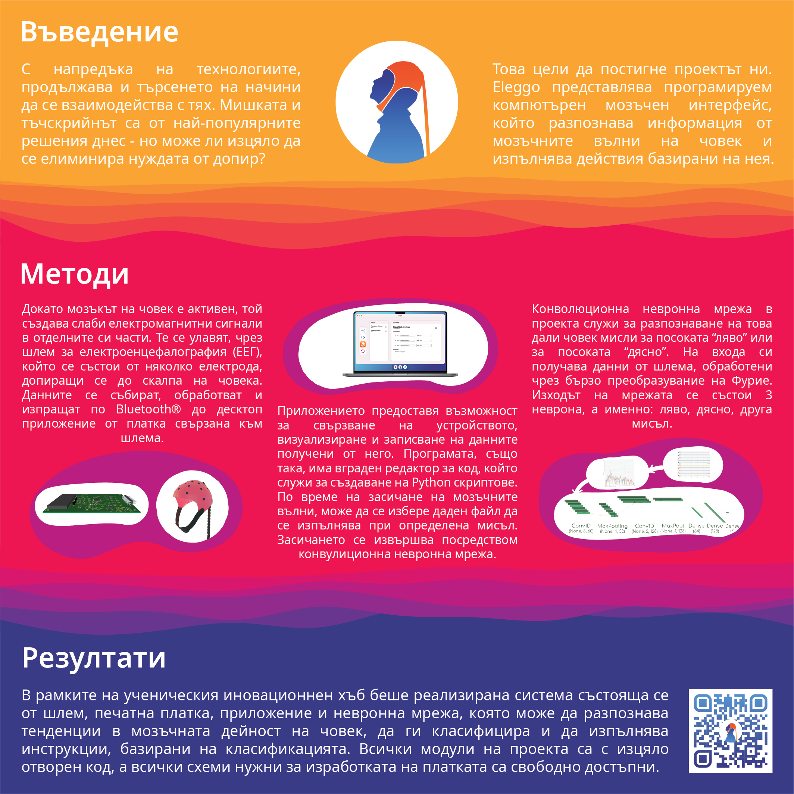

  
  <h1 align="center">Eleggo</h1>
  

    A programmable brain computer interface, which uses a electroencephalography and machine learning to complete tasks such as hand movement recognition, directional thinking recognition, etc.
  

    
    

## Get started

https://user-images.githubusercontent.com/26301867/143781633-97c246e6-2fe1-4d5f-94f9-8cc198a543af.mp4

The project consists of 3 main components:
- **Machine learning algorithms**, such as hand movement detection and directional thinking detection, which process EEG data for classification (located in "[eleggo-ml](https://github.com/braind3d/eleggo-ml)")
- **Server & User client**, which provides an easy to program way for setting the se (located in "[eleggo-server](https://github.com/braind3d/eleggo-server)")
- **BCI processing board**, which is using the OpenBCI Cyton board as a base and modifying it so that it only uses non-deprecated elements (located in"[eleggo-hardware](https://github.com/braind3d/eleggo-hardware)")

For each of the components' repositories there is a corresponding `README.md` with instructions on how to get started.

    

## Authors
<table width="100%">

  <tr>
    <td>
        
        

            <b>Angel Penchev</b>
            
        

    </td>
    <td>
        
        

            <b>Bogdan Mironov</b>
            
        

    </td>
    <td>
        
        

            <b>Madlen Sarkisian</b>
            
        

    </td>
    <td>
        
        

            <b>Miroslav Mirchev</b>
            
        

    </td>
    <td>
        
        

            <b>Simeon Georgiev</b>
            
        

    </td>
  </tr>
</table>

## Contributions
1. Fork it (<https://github.com/braind3d/eleggo/fork>)
2. Create your feature branch (`git checkout -b feature/fooBar`)
3. Commit your changes (`git commit -a`)
4. Push to the branch (`git push origin feature/fooBar`)
5. Create a new Pull Request
6. Upon review it will be merged.

## License
Distributed under the BSD-3 Cause license. See [LICENSE](LICENSE) for more information.
